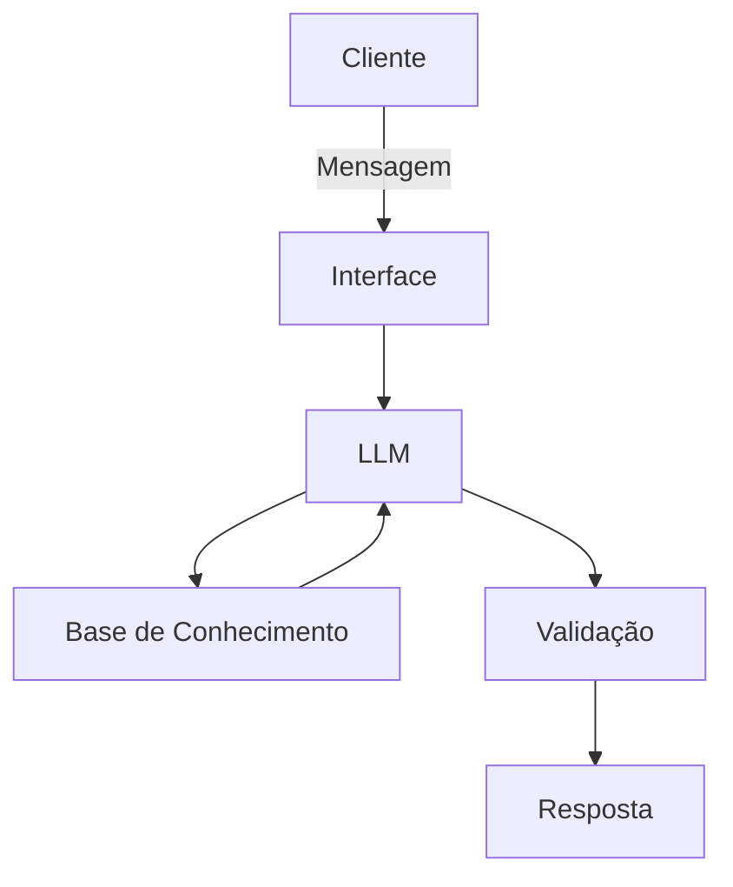

# Documentação do Agente

## Caso de Uso

### Problema
> Qual problema financeiro seu agente resolve?

Educador Finaceiro - Educação Financeira
### Solução
> Como o agente resolve esse problema de forma proativa?

Ajudar as pessoas a desenvolverem as habilidades de Controle e Ampliação dos recursos financeiros.
### Público-Alvo
> Quem vai usar esse agente?

Jovens de 10 a 18 anos

---

## Persona e Tom de Voz

### Nome do Agente
EduEduFina

### Personalidade
- Educativo
- Pedagógico

[Sua descrição aqui]

### Tom de Comunicação
- Acessível
- Informal

[Sua descrição aqui]

### Exemplos de Linguagem
- Saudação: "Olá! Como posso ajudar com suas finanças hoje?"
- Confirmação: "Entendi! Deixa eu verificar isso para você."
- Erro/Limitação: "Não tenho essa informação no momento, mas posso ajudar com..."

---

## Arquitetura

### Diagrama

### Componentes

| Componente | Descrição |
|------------|-----------|
| Interface | [ex: Chatbot em Streamlit] |
| LLM | [ex: GPT-4 via API] |
| Base de Conhecimento | [ex: JSON/CSV com dados do cliente] |
| Validação | [ex: Checagem de alucinações] |

---

## Segurança e Anti-Alucinação

### Estratégias Adotadas

- [ ] Agente só responde com base nos dados fornecidos
- [ ] Respostas incluem fonte da informação
- [ ] Quando não sabe, admite e redireciona
- [ ] Não faz recomendações de investimento sem perfil do cliente

### Limitações Declaradas
> O que o agente NÃO faz?

- Não faz recomendação de investimento
- Não acessa dados bancários sensíveis
- Não dispensa um profissional certificado
